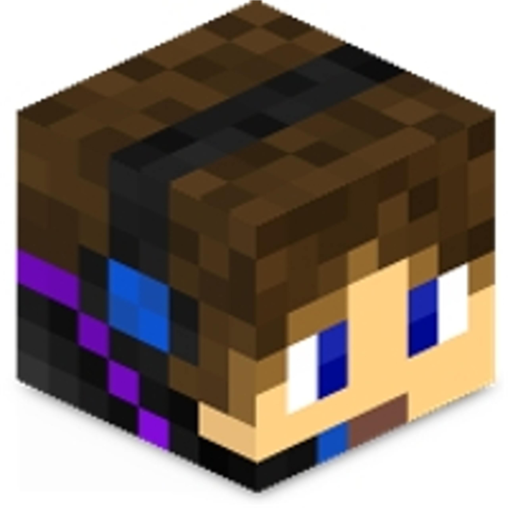

[![Contributors][contributors-shield]][contributors-url]
[![Forks][forks-shield]][forks-url]
[![Stargazers][stars-shield]][stars-url]
[![Issues][issues-shield]][issues-url]
[![MIT License][license-shield]][license-url]
[![LinkedIn][linkedin-shield]][linkedin-url]


<!-- PROJECT LOGO -->
<br />
<p align="center">
  <a href="https://github.com/ScorchChamp/ScorchAI">
    
  </a>

  <h3 align="center">ScorchAI Twitch Bot</h3>

  <p align="center">
    Twitch Clip Bot
    <br />
    <a href="https://github.com/ScorchChamp/ScorchAI/releases/">Releases »</a>
    <br />
    <br />
    <a href="https://github.com/ScorchChamp/ScorchAI">View Demo</a>
    ·
    <a href="https://github.com/ScorchChamp/ScorchAI/issues">Report Bug</a>
    ·
    <a href="https://github.com/ScorchChamp/ScorchAI/issues">Request Feature</a>
  </p>
</p>

<details open="open">
  <summary><h2 style="display: inline-block">Table of Contents</h2></summary>
  <ol>
    <li><a href="#about-the-project">About The Project</a></li>
    <li><a href="#releases">Releases</a></li>
    </li>
    <li>
      <a href="#getting-started">Getting Started</a>
      <ul>
        <li><a href="#prerequisites">Prerequisites</a></li>
        <li><a href="#installation">Installation</a></li>
      </ul>
    </li>
    <li><a href="#usage">Usage</a></li>
    <li><a href="#roadmap">Roadmap</a></li>
    <li><a href="#contributing">Contributing</a></li>
    <li><a href="#license">License</a></li>
    <li><a href="#contact">Contact</a></li>
  </ol>
</details>

## <b>DISCLAIMER: THIS PROJECT IS NOT YET FREE TO USE </b>

<!-- ABOUT THE PROJECT -->
## About The Project

This bot was made after a lack of archiving of Twitch clips on youtube. I came with the idea to make a bot that automatically uploads the 24 most viewed clips per day per category. 

## Releases
Download the latest version of [ScorchAI](https://github.com/ScorchChamp/ScorchAI/releases/) and extract the ScorchAI-x.zip / ScorchAI-x.tar.gz. Make sure to read <a href="#getting-started">Getting Started</a>.


<!-- GETTING STARTED -->
## Getting Started

To get a local copy up and running follow these simple steps.

### Prerequisites

You need to create an application over at [The Youtube Developer Console](https://console.cloud.google.com/apis/dashboard) with the Data APIv3. When you first run your application, you should get a link where you can accept your request.
#### WARNING: YOUR APPLICATION HAS TO BE AUDIT BY YOUTUBE TO USE IT WITHOUT IT BEING BLOCKED</b>

In the assets folder you should add the following files:
1. auth.json
    ```json
   {
        "twitch": {
            "client-id": "YOUR CLIENT ID",
            "client-secret": "YOUR CLIENT SECRET",
            "OAUTH": "Bearer YOUR OAUTH TOKEN"
        }
    }
   ```
2. client_secrets.json
    ```json
   {
        "web": {
            "client_id": "YOUR CLIENT ID",
            "client_secret": "YOUR CLIENT SECRET",
            "redirect_uris": [],
            "auth_uri": "https://accounts.google.com/o/oauth2/auth",
            "token_uri": "https://accounts.google.com/o/oauth2/token"
        }
    }
   ```

### Installation

1. Clone the repo
   ```sh
   git clone https://github.com/ScorchChamp/ScorchAI_name.git
   ```
1. Install Libraries
   ```sh
   pip install -r requirements.txt
   ```


<!-- USAGE EXAMPLES -->
## Usage

This application can be used on multiple channels. But be aware that have a limited amount of quota with the youtube datav3 api.

In TwitchDownload.py specify which games/channels you want to upload to your channel:
   ```python
   dc.generateClipsFromData("https://api.twitch.tv/helix/clips", {
       "game_id": "509658",   # JUST CHATTING
       "first": "8", 
       "started_at": yesterday_date_formatted
    })
   ```

Assets/description.txt specifies the default video description. Change this to your liking:

```
#ScorchAI #Shorts
👀 Check that you are subscribed!
⚠ EXPAND ME ⚠

▬▬▬▬▬▬▬▬▬▬▬▬▬▬▬▬▬▬▬▬▬▬▬▬▬▬▬▬▬▬▬▬

✅ Socials:

👑 Discord: https://discord.gg/5Z82Tjt 
👑 Main Channel: https://www.youtube.com/channel/UCdWXErDsp1GJASnmLm5cUCA
👑 Twitch: https://twitch.tv/scorchchamp

▬▬▬▬▬▬▬▬▬▬▬▬▬▬▬▬▬▬▬▬▬▬▬▬▬▬▬▬▬▬▬▬

🌼 INFO ABOUT THIS CHANNEL 🌼

➾ This video was uploaded via ScorchAI. This Application has been approved by YouTube Audit.
➾ This AI is currently in its test-fase; Huge changes will be made to the AI.

⚡ Do you want specific games/creators added as clips? Create a ticket over at the #create-ticket on my discord!

⚐ If the title is wrong or the content is offensive/not interesting/bad/etc please, again, contact me over at discord.

👑 CONTRIBUTE: https://github.com/ScorchChamp/ScorchAI

▬▬▬▬▬▬▬▬▬▬▬▬▬▬▬▬▬▬▬▬▬▬▬▬▬▬▬▬▬▬▬▬

📷 VIDEO INFO 
✍ contact me on Discord under #create-ticket with this videoID for questions or notices:
```


<!-- ROADMAP -->
## Roadmap

See the [open issues](https://github.com/ScorchChamp/ScorchAI_name/issues) for a list of proposed features (and known issues).


<!-- CONTRIBUTING -->
## Contributing

Contributions are what make the open source community such an amazing place to be learn, inspire, and create. Any contributions you make are **greatly appreciated**.

1. Fork the Project
2. Create your Feature Branch (`git checkout -b feature/AmazingFeature`)
3. Commit your Changes (`git commit -m 'Add some AmazingFeature'`)
4. Push to the Branch (`git push origin feature/AmazingFeature`)
5. Open a Pull Request


<!-- LICENSE -->
## License

This application is <b>NOT YET</b> free to use. Contact me about fair use, if you want to use it.


<!-- CONTACT -->
## Contact

ScorchChamp - scorchchamp@gmail.com

Project Link: [https://github.com/ScorchChamp/ScorchAI](https://github.com/ScorchChamp/ScorchAI)


[contributors-shield]: https://img.shields.io/github/contributors/ScorchChamp/ScorchAI.svg?style=for-the-badge
[contributors-url]: https://github.com/ScorchChamp/ScorchAI/graphs/contributors
[forks-shield]: https://img.shields.io/github/forks/ScorchChamp/ScorchAI.svg?style=for-the-badge
[forks-url]: https://github.com/ScorchChamp/ScorchAI/network/members
[stars-shield]: https://img.shields.io/github/stars/ScorchChamp/ScorchAI.svg?style=for-the-badge
[stars-url]: https://github.com/ScorchChamp/ScorchAI/stargazers
[issues-shield]: https://img.shields.io/github/issues/ScorchChamp/ScorchAI.svg?style=for-the-badge
[issues-url]: https://github.com/ScorchChamp/ScorchAI/issues
[license-shield]: https://img.shields.io/github/license/ScorchChamp/ScorchAI.svg?style=for-the-badge
[license-url]: https://github.com/ScorchChamp/ScorchAI/blob/master/LICENSE.txt
[linkedin-shield]: https://img.shields.io/badge/-LinkedIn-black.svg?style=for-the-badge&logo=linkedin&colorB=555
[linkedin-url]: https://www.linkedin.com/in/lars-cornelissen-56504520b/
[youtube-url]: https://www.youtube.com/channel/UCYpqUStHIE9CmgDPkAmN4Sg