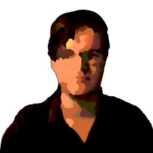

[![Contributors][contributors-shield]][contributors-url]
[![Forks][forks-shield]][forks-url]
[![Stargazers][stars-shield]][stars-url]
[![Issues][issues-shield]][issues-url]
[![MIT License][license-shield]][license-url]
[![LinkedIn][linkedin-shield]][linkedin-url]


<!-- PROJECT LOGO -->
<br />
<p align="center">
  <a href="https://github.com/ScorchChamp/ScorchAI">
    
  </a>

  <h3 align="center">ScorchAI</h3>

  <p align="center">
    Twitch Clip Bot
    <br />
    <a href="https://github.com/ScorchChamp/ScorchAI/releases/">Releases »</a>
    <br />
    <br />
    <a href="https://github.com/ScorchChamp/ScorchAI">View Demo</a>
    ·
    <a href="https://github.com/ScorchChamp/ScorchAI/issues">Report Bug</a>
    ·
    <a href="https://github.com/ScorchChamp/ScorchAI/issues">Request Feature</a>
  </p>
</p>

<details open="open">
  <summary><h2 style="display: inline-block">Table of Contents</h2></summary>
  <ol>
    <li><a href="#about-the-project">About The Project</a></li>
    <li><a href="#releases">Releases</a></li>
    </li>
    <li>
      <a href="#getting-started">Getting Started</a>
      <ul>
        <li><a href="#prerequisites">Prerequisites</a></li>
        <li><a href="#installation">Installation</a></li>
      </ul>
    </li>
    <li><a href="#usage">Usage</a></li>
    <li><a href="#roadmap">Roadmap</a></li>
    <li><a href="#contributing">Contributing</a></li>
    <li><a href="#license">License</a></li>
    <li><a href="#contact">Contact</a></li>
  </ol>
</details>

## <b>DISCLAIMER: THIS PROJECT IS NOT FREE TO USE, CONTACT ME FOR DETAILS </b>

<!-- ABOUT THE PROJECT -->
## About The Project

I am an IT student that took a year off to relieve some stress during covid. Now, I still wanted to program/code some fun stuff. During this year, many clip channels started to boom. The flaw with these channel, though, is that they require someone to download clips and reupload the all manually. <br>
<br>
Now, I wanted to make a bot that does this process automatically, thus the idea for ScorchAI. (Scorch is my IGN for most games and AI sounds cool)
<br>
<i>ps. the code is ugly, butit works. If you dont like it, make a pull request</i>
<br>
<br>
<i>Proof of concept (121.000 views per hour on main clip channel):</i><br>


## Releases
Download the latest version of [ScorchAI](https://github.com/ScorchChamp/ScorchAI/releases/) and extract the ScorchAI-x.zip / ScorchAI-x.tar.gz. Make sure to read <a href="#getting-started">Getting Started</a>.


<!-- GETTING STARTED -->
## Getting Started

To get a local copy up and running follow these simple steps.
#### WARNING: YOUR APPLICATION HAS TO GO THROUGH AUDIT BY YOUTUBE TO USE IT WITHOUT IT BEING BLOCKED</b>

### Prerequisites

You need to create an application over at [The Youtube Developer Console](https://console.cloud.google.com/apis/dashboard) with the Data APIv3. When you first run your application, you should get a link where you can accept your request.

In the assets folder you should add the following files:
1. client_secrets.json
    ```json
   {
        "web": {
            "client_id": "YOUR CLIENT ID",
            "client_secret": "YOUR CLIENT SECRET",
            "redirect_uris": [],
            "auth_uri": "https://accounts.google.com/o/oauth2/auth",
            "token_uri": "https://accounts.google.com/o/oauth2/token"
        }
    }
   ```
2. auth.json
   ```json
    {
      "twitch": {
        "client-id": "CLIENT ID", 
        "client-secret": "CLIENT SECRET", 
        "redirect-uri": "REDIRECT URI", // Probably https://localhost
        "OAUTH": "OAUTH TOKEN", // This could be empty, then you should run initial_oauth.py once
        "refresh-token": "REFRESH TOKEN" // Used to reset the oauth token if it runs out (happens like 10x a day)
      }
    }
   ```

### Installation

1. Clone the repo
   ```sh
    git clone https://github.com/ScorchChamp/ScorchAI_name.git
   ```
1. Install Libraries
   ```sh
    pip install -r requirements.txt
   ```


<!-- USAGE EXAMPLES -->
## Usage

This application can be used on multiple channels. But be aware that have a limited amount of quota with the youtube datav3 api.

In assets/categories.json specify which games/channels you want to upload to your channel:
   ```json
    {
      "games": {

      },
      "broadcasters": {
          "SCORCHCHAMP": {
              "priority": 1,
              "min_views": 0,
              "real_name": "ScorchChamp",
              "parameters": {
                  "first": "100",
                  "broadcaster_id": "58251106"
              }
          }
      },
      "blacklisted_broadcasters": []
    }
   ```


Assets/description.txt specifies the default video description. Change this to your liking:

```
👀 Check that you are subscribed!

▬▬▬▬▬▬▬▬▬▬▬▬▬▬▬▬▬▬▬▬▬▬▬▬▬▬▬▬▬▬▬▬

✅ Socials:

👑 Discord: https://discord.gg/5Z82Tjt 
👑 Twitch: https://twitch.tv/scorchchamp
👑 Main Channel: https://www.youtube.com/c/ScorchChamp

▬▬▬▬▬▬▬▬▬▬▬▬▬▬▬▬▬▬▬▬▬▬▬▬▬▬▬▬▬▬▬▬

****If you are this broadcaster, and want this video removed, please let me know in either the comments, my business e-mail or in my discord.****
#ScorchAI #Shorts
```


<!-- ROADMAP -->
## Roadmap

See the [open issues](https://github.com/ScorchChamp/ScorchAI_name/issues) for a list of proposed features (and known issues).


<!-- CONTRIBUTING -->
## Contributing

Contributions are what make the open source community such an amazing place to be learn, inspire, and create. Any contributions you make are **greatly appreciated**.

1. Fork the Project
2. Create your Feature Branch (`git checkout -b feature/AmazingFeature`)
3. Commit your Changes (`git commit -m 'Add some AmazingFeature'`)
4. Push to the Branch (`git push origin feature/AmazingFeature`)
5. Open a Pull Request

<!-- CONTACT -->
## Contact

ScorchChamp - scorchchamp@gmail.com

Project Link: [https://github.com/ScorchChamp/ScorchAI](https://github.com/ScorchChamp/ScorchAI)


[contributors-shield]: https://img.shields.io/github/contributors/ScorchChamp/ScorchAI.svg?style=for-the-badge
[contributors-url]: https://github.com/ScorchChamp/ScorchAI/graphs/contributors
[forks-shield]: https://img.shields.io/github/forks/ScorchChamp/ScorchAI.svg?style=for-the-badge
[forks-url]: https://github.com/ScorchChamp/ScorchAI/network/members
[stars-shield]: https://img.shields.io/github/stars/ScorchChamp/ScorchAI.svg?style=for-the-badge
[stars-url]: https://github.com/ScorchChamp/ScorchAI/stargazers
[issues-shield]: https://img.shields.io/github/issues/ScorchChamp/ScorchAI.svg?style=for-the-badge
[issues-url]: https://github.com/ScorchChamp/ScorchAI/issues
[license-shield]: https://img.shields.io/github/license/ScorchChamp/ScorchAI.svg?style=for-the-badge
[license-url]: https://github.com/ScorchChamp/ScorchAI/blob/master/LICENSE.txt
[linkedin-shield]: https://img.shields.io/badge/-LinkedIn-black.svg?style=for-the-badge&logo=linkedin&colorB=555
[linkedin-url]: https://www.linkedin.com/in/lars-cornelissen-56504520b/
[youtube-url]: https://www.youtube.com/channel/UCYpqUStHIE9CmgDPkAmN4Sg